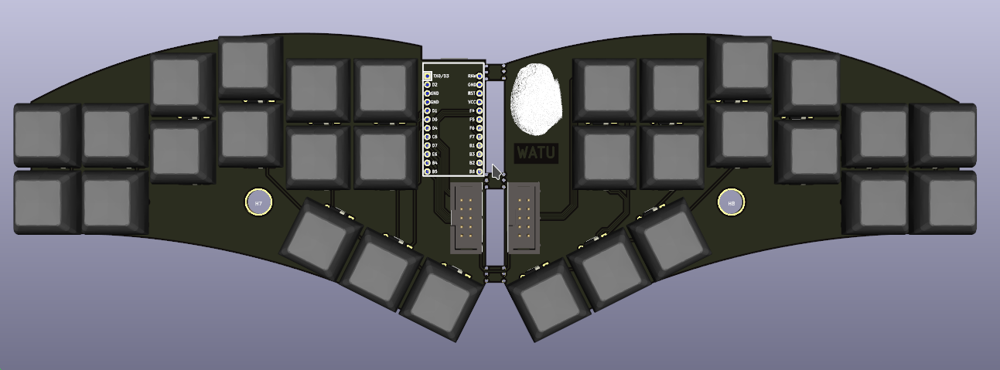

# Watu

Watu (stone in [javanese language](https://en.wikipedia.org/wiki/Javanese_language))
is a split keyboard that is intended for [short hand typing](https://en.wikipedia.org/wiki/Stenotype)
with plover, i guess.

## Pics

Currently in prod.
but see this:

